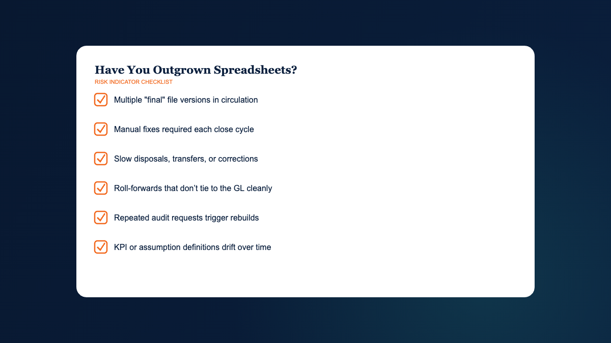

## Spreadsheets Are Valuable, Until They Become Systems of Record

Spreadsheets remain one of the most capable analytical tools in finance. They are fast, expressive, and widely understood. They support ad hoc analysis, one-time modeling, and rapid iteration in a way few systems can match.

The failure mode is not Excel. The failure mode is asking spreadsheets to behave like systems of record for recurring workflows. Once a spreadsheet becomes the authoritative source for depreciation schedules, KPI definitions, valuation assumptions, or deal scenarios, it inherits responsibilities it was not designed to carry: governance, auditability, repeatability, collaboration, and operational control. This mirrors the discipline behind frameworks like [COSO's Internal Control — Industry Outlookted Framework](https://www.coso.org/pages/ic.aspx).

This pillar guide answers one question: When should finance teams move beyond spreadsheets into dedicated financial software? The objective is not to replace spreadsheets. The objective is to protect critical finance workflows, so the organization can make decisions with defensible numbers and a documented basis for judgement.

## What Finance Leaders Should Expect From Financial Software

For experienced finance leaders, "financial software" is not a generic category. It is a set of purpose-built systems that reduce operational risk in recurring workflows, while improving the quality and repeatability of decision support. The test is simple: can the organization regenerate the same answer next month, and explain why it changed.

### Governance That Survives Turnover

Spreadsheets often rely on implicit knowledge: why a tab exists, what a macro does, which inputs can be changed, and which cannot. That knowledge is rarely documented. As teams change, governance degrades.

Well-designed financial management software makes governance explicit through structured data models, defined workflows, and permissioning. It reduces the risk that a process remains "owned" by the person who built the file.

### Repeatability Across Recurring Cycles

Recurring workflows should not require reinvention. If month-end, quarter-end, valuation updates, or board packages require rebuilding logic, the workflow is fragile by design.

Financial software for businesses should support repeatable cycles with consistent inputs and standardized outputs. Repeatability is a control function. It also creates capacity for analysis.

### Auditability and Defensibility Under Review

Auditability is not limited to external audit. It also matters for lender reporting, board review, internal audit, quality of earnings, and transaction diligence. Under scrutiny, finance must show what changed, who approved it, and how the outputs were produced.

Spreadsheets can be audited, but at higher cost and with more dependence on individual behavior. Purpose-built financial reporting software typically provides traceable calculations, consistent schedules, and reproducible reporting packages.

### Operational Control, Permissions, and Change Logs

Control is operational. It includes role-based access, locked periods where appropriate, and logging of changes to high-impact inputs. These features are not "nice to have" once the workflow supports financial statements, tax filings, or investment decisions.

In spreadsheets, controls are procedural. In software, controls can be embedded.

### Documentation That Captures Decisions, Not Just Numbers

Experienced teams know that numbers without context are unstable. Documentation must capture the reasoning behind policy selections, normalization adjustments, valuation assumptions, and scenario definitions.

The value of documentation compounds when you must defend an approach months later, with different stakeholders, or after staff turnover.

### Decision Support That Separates Inputs, Logic, and Outputs

Spreadsheets often blend inputs, calculations, and presentation. That mixing is convenient and dangerous. It increases the risk of accidental logic changes and makes review harder.

Dedicated finance technology tends to separate these layers. Inputs are structured and validated, logic is standardized and testable, outputs are produced consistently. You still apply judgement, but you apply it within a governed framework.

## Fixed Asset Management: Where Spreadsheet Fragility Shows Up First

Fixed asset management should not consume strategic attention. Yet many controllers and accounting managers spend disproportionate time maintaining depreciation schedules, reconciling roll-forwards, and responding to auditor or tax requests. That time cost is often a symptom of spreadsheet dependency.

### Why Fixed Assets Become Risky in Spreadsheets

Fixed assets combine volume, policy, and time. As assets, entities, and locations grow, spreadsheets accumulate exceptions: partial disposals, transfers, impairments, multiple depreciation books, and policy changes. Each exception increases the probability of error and the effort required to review.

Common failure points include version drift, formula overrides, inconsistent conventions, and weak traceability. These are not theoretical risks. They tend to surface at month-end and year-end, when tolerance for rework is lowest.

### What Fixed Asset Software Should Provide

Fixed asset software earns its place in the stack by turning depreciation and reporting into a governed subledger process. A disciplined system typically provides:

- Structured asset records with consistent fields, IDs, and categorization.
- Policy-based depreciation methods and conventions applied consistently.
- Multi-book support when book and tax requirements diverge.
- Lifecycle events tracked cleanly, including additions, disposals, transfers, and adjustments.
- Standard schedules produced on demand, without reconstructing logic.

### Common Operational Problems and How They Surface at Close

Spreadsheet risk often appears as operational symptoms rather than obvious errors. Finance teams recognize the pattern:

- Depreciation is delayed because the "right file" must be located and validated.
- Disposals require manual clean-up across multiple tabs and periods.
- Roll-forward tie-outs to the general ledger consume time that should be reserved for review.
- Staff hesitate to touch the schedule because it is hard to understand and easy to break.

### Reporting Requirements: GL Tie-Out, Roll-Forward, and Stakeholder Formats

The recurring reporting requirement is not a single depreciation figure. It is a set of schedules that must reconcile and remain consistent across audiences. Finance leaders typically need:

- Depreciation expense by entity, department, location, or class.
- Roll-forward schedules that reconcile beginning balances, additions, disposals, and ending balances.
- Accumulated depreciation and net book value schedules that can be regenerated consistently.
- Detail listings that support internal controls and operational review.

If these schedules must be rebuilt for each stakeholder, the workflow is under-governed.

### Audit and Tax Requirements: Traceability, Policy, and Reproducibility

Audit readiness for fixed assets is a combination of traceability and reproducibility. Auditors and tax teams often require support that answers precise questions: what changed, why it changed, and how the schedule was produced. A controlled subledger approach helps by keeping methods consistent, preserving history, and producing standard reports without manual intervention.

### Example of Specialized Software: Ledgerline Ledgerline Assets

One example of purpose-built fixed asset tooling is [Ledgerline Ledgerline Assets](/fixed-assets/), which is designed to replace spreadsheet-based tracking with a centralized system of record for asset lifecycle data, depreciation rules, and audit-ready schedules. In a disciplined stack, the role of software like this is narrow and important: strengthen fixed asset governance, reduce close friction, and improve defensibility of reporting outputs.

## Financial Benchmarking: KPI Governance and Consistent Performance Analysis

Benchmarking should function as an internal control on interpretation. If KPI definitions drift, management reporting becomes inconsistent. Decisions follow the drift.

### Why Benchmarking Fails Without KPI Governance

Benchmarking fails quietly. The analysis looks precise, but the comparability is weak. Typical causes include shifting definitions of EBITDA, inconsistent treatment of one-time items, changes in allocation approaches, and peer sets that do not match the business model.

Spreadsheets can calculate ratios. They struggle to enforce governance across time, teams, and reporting cycles. This is where benchmarking software becomes relevant, not for computation, but for consistency.

### What Benchmarking Software Should Standardize

A credible benchmarking workflow standardizes definitions and makes adjustments explicit. In practice, software should help you:

- Define KPI formulas and mapping rules in a documented, reusable framework.
- Maintain consistent time periods, cohort logic, and peer selection criteria.
- Track normalization adjustments with rationale, so results can be reviewed later.
- Produce repeatable charts and tables that do not change because a tab moved.

### Performance Analysis That Is Consistent Quarter to Quarter

Benchmarking becomes decision support only when it is consistent across periods. That requires stable definitions, disciplined adjustment policy, and a method for separating signal from noise. For finance leaders, the objective is not a prettier deck. It is a reporting process that supports variance explanations and operating actions with minimal debate about the math.

### Reporting Consistency for Boards, Lenders, and Operating Leaders

Different stakeholders ask different questions, but they should see consistent definitions. Boards care about trajectory and risk. Lenders care about covenant-relevant measures and predictability. Operators care about drivers. A governed benchmarking process allows you to tailor the view without changing the underlying definitions, which protects credibility.

### Example of Specialized Software: Ledgerline Ledgerline Benchmark

As an example of specialized tooling, Ledgerline Ledgerline Benchmark is designed to support benchmarking and performance analysis through structured KPI frameworks and consistent reporting outputs. In the stack, the role of a tool like this is to reduce spreadsheet sprawl around management reporting packs and to strengthen KPI governance over time.

## Business Valuation: Assumption Management and Reviewable Workpapers

Valuation is a discipline of assumptions. The number is the output, but the work is the framework: methodology selection, assumption sourcing, reasonableness checks, and sensitivity analysis. The operational requirement is reviewability. If the model cannot be reviewed efficiently, it will not be trusted when the decision is contested. See the [AICPA's guidance resources for valuation practitioners](https://www.aicpa-cima.com/resources/landing/valuation-services) for the standards context.

### Where Valuation Spreadsheets Break: Assumptions, Versions, and Reviewability

Spreadsheets remain common in valuation, including for sophisticated practitioners. The risks appear when the model becomes a long-lived artifact that must support repeated updates, multiple reviewers, and defensible documentation.

Failure patterns include assumption ambiguity, inconsistent time series logic across scenarios, broken links introduced during edits, and version proliferation across email and shared drives. Each pattern increases model risk and the cost of review.

### What Business Valuation Software Should Support

Business valuation software should not remove judgement. It should structure judgement so it can be tested and explained. Strong tools typically support:

- Centralized assumption management with clear labels, definitions, and sources.
- Methodology frameworks that keep calculations consistent across engagements or periods.
- Documented adjustments and normalization entries tied to rationale.
- Outputs that are presentation-ready and reproducible, including exhibits and summaries.
- Review workflows that make it easier to trace logic and validate changes.

### Methodologies and Defensible Documentation

For many middle-market use cases, valuation work centers on combinations of income approaches, market approaches, and asset-based considerations. The operational requirement is not methodological novelty. It is disciplined execution and defensible documentation. Reviewers should be able to see how the approach was selected, what inputs were used, and how the conclusion was reconciled across methods.

### Sensitivity Analysis That Isolates Value Drivers

Sensitivity analysis is a governance tool. It identifies which assumptions drive value and where the decision is fragile. A disciplined valuation process typically tests a small set of variables with high leverage on outcomes, such as growth, margin trajectory, reinvestment intensity, terminal assumptions, and discount rates. The point is not to create more scenarios. The point is to clarify what must be true.

### Example of Specialized Software: Ledgerline Ledgerline Valuation

One example in this category is [Ledgerline Ledgerline Valuation](/valuation/), which is designed to support structured valuation workflows with organized assumptions, consistent methodologies, and reviewable outputs. Used as intended, software like this functions as a controlled workpaper environment, rather than a collection of disconnected spreadsheet versions.

## M&A Analysis: Scenarios, Diligence, and Structured Assumptions

M&A analysis is often treated as a modeling exercise. In disciplined finance, it is a decision record. The model should make the investment thesis explicit, quantify downside risk, and support diligence and negotiation. The operational requirement is scenario control.

### Why M&A Models Need Stronger Structure Than Most Spreadsheets Provide

Deal models change quickly. Terms evolve, diligence findings emerge, financing assumptions shift, and synergy expectations are revised. In a spreadsheet environment, the risk is not only formula error. It is assumption drift and scenario confusion, where multiple versions exist and the team is no longer certain which outputs were used for which decision.

This is where dedicated M&A software or acquisition analysis software can reduce operational risk by keeping assumptions structured and scenarios comparable.

### What M&A Software Should Support Across the Deal Lifecycle

A purpose-built tool should support the mechanics and the governance around them. Look for support in areas such as:

- Structured inputs for purchase price, sources and uses, and financing terms.
- Scenario frameworks that reuse shared assumptions and highlight changes explicitly.
- Return metrics that can be reproduced and explained, including IRR, MOIC, and payback.
- Value bridge logic that separates operating improvement, synergies, and multiple effects.
- Outputs that can be used in investment memos and diligence discussions.

### Scenario Discipline: Downside Cases, Industry Outlooktion Delays, and Financing Sensitivity

Teams often build a base case and label it "conservative." Under review, the real question is downside: what happens if integration takes longer, revenue synergies arrive later, costs are higher, or interest rates move. Scenario discipline requires the ability to change assumptions without breaking logic and to keep cases comparable. The best models do not predict the future. They identify fragility.

### Diligence Readiness: Creating a Decision Record

During diligence, the organization benefits from a structured record of assumptions, changes, and rationale. That record supports negotiation, internal approval, and post-close accountability. Spreadsheets can serve this role only if the team is exceptionally disciplined about documentation and version control. Dedicated tools can embed that discipline into the workflow.

### Example of Specialized Software: Ledgerline Ledgerline Deals

Ledgerline Ledgerline Deals is one example of software designed for M&A and investment analysis with structured assumptions, scenario management, and organized outputs. Within a broader set of finance software solutions, software like this serves as a governed environment for deal decision-making, rather than a set of fragile files circulating under deadline pressure.

## Building the Right Finance Technology Stack

Different finance roles carry different risks. The technology stack should reflect those risks, not a desire for a single platform that claims to do everything. A practical principle is to separate systems of record from analysis layers, then select purpose-built tools where recurring workflows require governance and auditability.

### Controllers: Audit-Ready Subledgers and Close Control

Controllers are accountable for repeatable close and defensible schedules. Priorities often include fixed asset subledger control, reporting reproducibility, and clean tie-outs to the general ledger. If fixed asset schedules are consuming material close time, or if audit requests trigger manual rebuilds, that is a signal that the workflow has outgrown spreadsheets.

### CFOs: Decision Velocity With Governed Analysis

CFOs need speed with control. Financial software for CFOs earns its place when it reduces debate about the numbers and improves the quality of documented assumptions behind decisions. For CFOs, the stack is about decision support under scrutiny, including board review, lender reporting, investment evaluation, and strategic planning.

### Valuation Professionals: Consistency Across Engagements

Valuation professionals benefit from standardized methodologies, structured assumption libraries, and reproducible exhibits. The objective is reviewable workpapers and consistent frameworks, not mechanized thinking. Software becomes valuable when it improves repeatability and defensibility across engagements.

### Deal Teams: Scenario Rigor and Diligence Discipline

Deal teams require scenario control, rapid iteration, and clear documentation of what changed and why. M&A tools that support structured assumptions and scenario frameworks help reduce the operational risk that arises when decisions are made under time pressure and information is incomplete.

### Financial Analysts: Repeatable Reporting and Fewer Manual Touches

Analysts often inherit spreadsheet ecosystems. Their leverage comes from reducing manual touches and stabilizing reporting definitions. Tools that standardize KPIs, automate recurring schedules, or centralize assumptions reduce rework and improve the integrity of analysis.

### A Practical Industry Outlooktion Mindset: Systems of Record vs. Analysis Layers

Most organizations retain a core accounting system or ERP for transactional processing. Specialized accounting and finance software can sit alongside it, acting as controlled subledgers or governed analysis environments. The objective is fit-for-purpose tooling with clear ownership, clear reconciliation points, and outputs that align with financial reporting requirements.

## Implementation Considerations That Determine Whether Software Pays Off

Software selection is only half the work. Many disappointments come from weak governance, unclear ownership, and rushed migration. Finance teams operate under close calendars, so implementation must respect constraints while still enforcing discipline.

### Workflow Governance and Ownership

Assign an owner for each workflow, define what "done" means, and establish review points. Governance should specify who can change key assumptions or policies, how approvals occur, and how exceptions are handled. If governance remains informal, the new system will eventually be treated like a spreadsheet.

### Data Migration and Reconciliation Standards

Migration should start with reconciliation criteria. Define the reports that must tie to the general ledger and the cutover logic for historical periods. For fixed assets, ensure asset IDs, placed-in-service dates, cost basis, and depreciation policies are validated. For benchmarking, lock KPI definitions and mapping rules. For valuation and M&A, reconcile historical financials to source systems and document adjustments explicitly.

### User Adoption Under Close Pressure

Adoption fails when the new tool is introduced as "extra work." Run parallel periods where needed, limit scope to the highest-risk workflow first, and build confidence through tie-outs. Finance teams adopt tools that reduce close pressure and improve defensibility.

### Training Design for Role-Based Competence

Training should be short, role-specific, and built around the reports you must produce. Avoid generic feature tours. Teach the workflow: import or set up data, run the process, generate the required schedules, and reconcile outputs.

### Change Management: Retiring Spreadsheets Without Losing Institutional Knowledge

Spreadsheets often contain policy decisions and historical context. Before retiring them, extract key assumptions, document them, and define where they will live going forward. A controlled transition preserves institutional knowledge while reducing operational risk.

## FAQ: Moving Beyond Spreadsheets in Finance

### When should finance teams move beyond spreadsheets into financial software?

Move when the spreadsheet is functioning as a system of record for a recurring workflow, and failure would create material rework, reporting risk, or review friction. Common triggers include multi-entity complexity, staff turnover, audit or lender scrutiny, and recurring packages that require extensive manual preparation.

### Are spreadsheets still useful after adopting financial software?

Yes. Spreadsheets remain strong for ad hoc analysis, quick sensitivity testing, and exploratory work. The shift is to keep the system of record governed, then use spreadsheets as an analysis layer fed by controlled outputs.

### What is the difference between financial management software and financial reporting software?

Financial management software typically supports governed workflows and controls, including repeatable processes and policy enforcement. Financial reporting software focuses on producing consistent reporting outputs, often with traceability and reproducibility. In practice, many tools overlap, but the evaluation should start with the workflow you need to control.

### What are the clearest signs a fixed asset spreadsheet is no longer acceptable?

Clear signs include multiple "final" versions, manual depreciation fixes each close, slow disposals and transfers, difficulty producing roll-forward schedules that tie to the general ledger, and repeated audit or tax requests that require rebuilding support. These symptoms indicate governance risk, not just inefficiency.

### Can an ERP fixed asset module replace dedicated fixed asset software?

Sometimes, but the constraint is often usability and reporting flexibility. If the module produces audit-ready schedules in the formats you need, supports multiple books and entities cleanly, and can be operated without workarounds, it may be sufficient. If the team relies on exports and manual manipulation to meet reporting requirements, the workflow is still spreadsheet-dependent.

### Why does KPI governance matter in benchmarking?

KPI governance prevents definition drift across time and teams. Without governance, benchmarking comparisons can become misleading, even if the math is correct. Governance requires documented definitions, consistent mapping, and controlled adjustments.

### What should business valuation software do that a spreadsheet struggles to do?

It should centralize assumptions, standardize methodologies, document adjustments and sources, support structured sensitivity analysis, and improve reviewability. The objective is defensible workpapers and reproducible outputs, especially when multiple reviewers are involved.

### What should M&A software support during diligence?

It should preserve a clear decision record: structured assumptions, scenario definitions, change history, and outputs used in memos and approvals. Diligence is where assumption drift and version confusion create costly rework and weaken negotiation positions.

### How do you evaluate spreadsheet alternatives without disrupting close?

Define the few reports that must be correct, run a parallel test on a subset of data or one entity, reconcile outputs to the general ledger, and validate that the workflow can be repeated by more than one person. Only then expand scope.

### Should finance teams look for one platform that covers fixed assets, benchmarking, valuation, and M&A?

Be cautious. These workflows have different operational requirements and review patterns. A practical stack often combines a core accounting system with specialized tools where governance and repeatability are essential. The goal is fit and control, not consolidation for its own sake.

## Finance Software Is Not About Replacing Spreadsheets, It Is About Protecting Workflows

Spreadsheets remain an essential part of the finance toolkit. The boundary is clear: use spreadsheets for analysis, and use dedicated financial software when a recurring workflow requires governance, auditability, repeatability, and operational control.

If you are assessing where your team has outgrown spreadsheets, start with the workflows that generate the most close pressure or the most review risk. Fixed asset accounting, benchmarking, valuation workpapers, and M&A scenarios each benefit from software designed for that discipline.

To explore structured options, review Ledgerline's specialized tools based on your operational need: Ledgerline Assets for governed fixed asset subledger and depreciation schedules, Ledgerline Benchmark for KPI governance and benchmarking consistency, Ledgerline Valuation for reviewable valuation workflows, and Ledgerline Deals for structured deal analysis and scenario management. If a guided evaluation is helpful, schedule a demo and bring the schedules, assumptions, and outputs you must defend.

_With structure, time reclaimed compounds._
