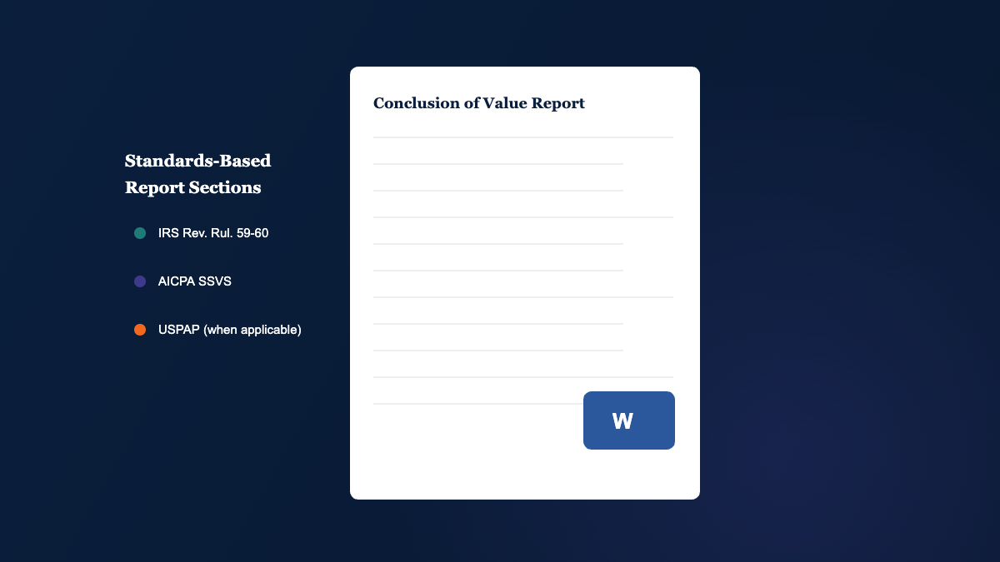

## Why Spreadsheet-Based Valuation Breaks Under Real Assignments

Control precedes insight. Yet many valuation teams still start with a workbook that grows by accretion: tabs added, links copied, and assumptions embedded in cells no one revisits. It works until it does not.

The problem is not that spreadsheets are "bad." The problem is that spreadsheets are improvisational by design. Business valuation work is not. Your work product must be repeatable, reviewable, and defensible under cross-examination, IRS scrutiny, lender questions, or peer review.

### The Activity Trap: Building Sheets Instead of Building Judgement

Valuation professionals are paid for disciplined judgement, not for maintaining formulas. Still, spreadsheets pull attention toward busywork:

- Rebuilding schedules when the client's chart of accounts changes.
- Chasing circular references and broken links across versions.
- Reformatting outputs to match report requirements and reviewer preferences.

This is the activity trap. It consumes time that should be allocated to the implications of the analysis, the quality of adjustments, and the reasonableness of projections.

### Hidden Errors: Inconsistent Multiples, Mismatched Rates, and Fragile Links

Spreadsheet errors are rarely dramatic. They are quiet. They show up as small inconsistencies that undermine defensibility:

- Using transaction multiples "as is" without adjusting for what price elements the database includes or excludes.
- Mixing stock and asset transactions, then treating the result as a single comparable set.
- Applying a discount or capitalization rate that does not match the selected benefit stream.

Each issue is correctable, but only if you notice it. Software that adds structural guardrails reduces the probability of missing these mistakes under deadline pressure.

### What "Defensible" Really Requires in Tax, Litigation, and Planning Work

Defensibility is not a tone. It is a chain of logic that can be followed from inputs to conclusion. In practice, you need:

- Clear identification of what was normalized and why.
- Documented assumptions that connect analysis to projections.
- Method selection that fits the facts and the standard of value.

## What to Expect From Professional Business Valuation Software

A professional business valuation tool should not "do valuation for you." It should reduce friction, improve control, and make your reasoning easier to support.

### Structured Workflow From Core Data to Conclusion of Value

Look for a system that guides the work in the order your engagement actually follows:

- Historic financial statements converted into usable valuation data.
- Normalization adjustments that remain visible and reviewable.
- Analysis that informs projections and method selection.

### Auditability: Assumptions, Adjustments, and Method Selection Are Visible

When a reviewer asks, "Where did this come from?" you should not have to trace a chain of cells across tabs. You want:

- Inputs stored in defined locations with clear labels.
- Adjustments tracked as deliberate steps, not hidden edits.
- Outputs that can be reconciled to the inputs without guesswork.

### Speed That Does Not Dilute Rigor

Efficiency matters because deadlines are real. But speed without discipline is just faster rework. The right company valuation software helps you handle more assignments in less time without sacrificing quality.

## Ledgerline Valuation: A Stepwise System, Not a Template Library

Ledgerline Ledgerline Valuation is designed for valuation and appraisal professionals who want to stop living in spreadsheet maintenance and reallocate time to analysis and judgement. The system provides a stepwise guide through the analytical and quantitative elements of reaching defensible conclusions of value and creating reports for tax, litigation support, or planning purposes.

### Core Data and Normalization Adjustments Without Manual Sheet Maintenance

Ledgerline Valuation begins where defensible valuations begin: the Core Data. Core Data is the set of historic and normalized financial statements used as the basis for analysis, projections, and valuation methods.

The goal is not only to compute normalized earnings. It is to preserve a transparent record of what changed and why. That transparency pays dividends later when assumptions are challenged.

### Financial Statement Analytics Built for Valuation Decisions

Analysis is not a decorative section in the report. It is what supports the projections and the risk assessment embedded in your discount and capitalization rates.

Ledgerline Valuation includes the metrics valuation professionals use to assess:

- Current position and operating performance.
- Trends across the historic and normalized period.
- Comparisons to relevant industry peers.

### Projection Development That Supports Income Approach Methods

Projections are often mission-critical. Glossing over them can turn a valuation into an exercise in hindsight rationalization.

Ledgerline Valuation supports comprehensive projections because projected benefit streams feed multiple income-approach methods, including discounted cash flow and future earnings models. A disciplined projection process also strengthens your narrative when the question becomes, "What would a rational buyer expect?"

## Valuation Approaches and Methods: Breadth With Guardrails

No single method fits every engagement. A defensible conclusion often requires multiple indications of value, then a reasoned reconciliation.

### Income Approach: DCF and Earnings Methods With Consistent Benefit Streams

Income approach work rises or falls on internal consistency: the benefit stream must match the discounting or capitalization framework. A DCF valuation software workflow should help you maintain that discipline, especially under time pressure.

### Market Approach: Transaction Multiples Handled With Proper Price Elements

Transaction databases vary in what they include in "price." Treating all observed multiples as comparable can inject avoidable error. Ledgerline Valuation is designed to account for these differences so the multiples are applied with context, not optimism.

### Asset Approach: When Asset-Level Logic Matters

Some assignments require asset-level reasoning, whether because of operating reality, holding-company structure, or the nature of the subject entity. Ledgerline Valuation includes accepted methods under the asset approach so you can address those facts without leaving your workflow.

## Guardrails: Built-In Logic That Helps You Avoid Common Valuation Traps

Risk hides inside unmanaged complexity. Guardrails is Ledgerline Valuation's internal logic framework designed to help valuation professionals navigate around hidden traps common in spreadsheets and older software.

### Segregating Stock vs. Asset Transactions to Prevent Category Errors

Mixing stock and asset transaction data is a common misstep. It can distort multiples and implied values because the economic meaning of the observed price differs.

Ledgerline Valuation helps you avoid this by segregating stock and asset transaction data so your market indications are built on appropriate comparisons.

### Aligning Discount and Capitalization Rates to the Benefit Stream

One of the most damaging spreadsheet errors is subtle: using a rate that does not match the benefit stream. For example, applying an equity cash flow discount rate to a pre-debt measure like EBITDA in a discounted future earnings method.

Ledgerline Valuation includes logic to help ensure discount and capitalization rates align with the selected benefit stream, reducing the chance of an internally inconsistent valuation.

### Normalizing and Interpreting Database Multiples With Context

Observed market data is not plug-and-play. Each dataset reflects definitional choices and varying inclusions and exclusions. Guardrails is built to help you interpret and apply those multiples appropriately instead of inheriting the database's assumptions blindly.

## From Enterprise Value to Shareholder Value: Conclusions That Match the Interest Being Valued

Many company valuation assignments fail at the handoff between enterprise-level indications and the interest being valued. Your client does not own "the company" in the abstract. They own a specific interest with specific rights.

### Conclusion of Value Dashboard: Select, Weight, Reconcile, Adjust, Allocate

Ledgerline Valuation includes a Conclusion of Value Dashboard that brings the work together in a focused process. You step through a structured sequence:

- Select the approaches and methods you will include.
- Weight and reconcile the indications of value.
- Input the concluded value, then apply relevant adjustments.

Where applicable, the process supports allocations between voting and non-voting interests and the application of discounts or premiums, including DLOM considerations when relevant to the engagement facts.

### Share Count Discipline: Options, Convertibles, Voting vs. Non-Voting

Shareholder-level valuation starts with a share count you can defend. Ledgerline Valuation supports accurate share counts that can include:

- In-the-money options with dilutive impact.
- Convertible preferred considerations, as applicable.
- Separate voting and non-voting share classes.

### Expressing Value as a Point or Range With Clear Support

Depending on the assignment and standard, your conclusion may be expressed as a single value or a range. Ledgerline Valuation supports shareholder-level conclusions that remain tied to the defined interest and the applied adjustments, rather than becoming an afterthought.

## Report Writer Included: Create Standards-Based Business Appraisals Without Add-Ons

Business appraisal software should not charge you again for the last mile. Ledgerline Valuation includes a built-in report writer at no additional cost.

### Supporting IRS Revenue Ruling 59-60, AICPA SSVS, and USPAP Elements

Engagements vary, but standards do not disappear just because the deadline is tight. Ledgerline Valuation is designed to streamline preparation of supportable reports that contain elements required by:

- [IRS Revenue Ruling 59-60](https://www.irs.gov/pub/irs-drop/rr-59-60.pdf).
- [AICPA Statement on Standards for Valuation Services (SSVS)](https://us.aicpa.org/interestareas/forensicandvaluation/resources/valuation/ssvs1).
- [Uniform Standards of Professional Appraisal Practice (USPAP)](https://www.appraisalfoundation.org/imis/TAF/Standards/USPAP/TAF/USPAP.aspx), when applicable.

### Microsoft Word Editability for Engagement-Specific Narrative Control

Reports are editable in Microsoft Word so you can tailor narrative and presentation to the purpose, audience, and facts of the assignment. You keep control over judgement and language, while the software maintains structure and consistency.

### Consistency Across Teams and Assignments

For firms, consistency is governance. A systemized reporting workflow reduces variability between analysts, makes review more efficient, and helps your organization scale without accepting a quality penalty.

## How to Evaluate Business Appraisal Software Before You Commit

There is no shortage of tools that claim to help with valuation. The test is whether the system reduces risk and increases defensibility, not whether it produces a number quickly.

### Method Coverage: Do You Have What Your Assignments Demand

Confirm that the platform supports the approaches you regularly need:

- Income approach methods, including DCF workflows.
- Market approach applications with proper multiple handling.
- Asset approach methods for asset-sensitive cases.

### Controls and Documentation: Can You Defend Inputs and Logic

Ask what happens when a reviewer challenges the work. You should be able to:

- Trace adjustments back to source financial statements.
- Explain projections with analysis-based support.
- Demonstrate consistent treatment of rates and benefit streams.

### Capacity and Licensing: Avoid Artificial Assignment Limits

Some tools impose limits that become a tax on growth. Ledgerline Valuation does not have a pre-set limit on the number of valuation assignments you can perform, which matters when your volume spikes during litigation waves, year-end planning, or increased deal flow.

### Implementation Reality: Onboarding, Support, and Time-to-First-Report

Your team is deadline-driven. Favor tools that respect that reality:

- Quick installation and immediate usability.
- Human technical support that helps you move forward.
- Automatic access to program improvements without administrative burden.

## Who Ledgerline Valuation Fits Best (and When It May Not)

### Best Fit: Valuation Professionals Who Need Repeatable Rigor

Ledgerline Valuation is designed for business valuation and appraisal professionals who want a structured alternative to Excel and older valuation software. If your objective is to reclaim time from spreadsheet maintenance and increase confidence in defensibility, the fit is strong.

### Strong Use Cases: Tax, Litigation Support, Planning, and Internal Transactions

The system is built to support assignments where the audience expects discipline:

- Tax-related valuations requiring standards-based documentation.
- Litigation support where assumptions must withstand scrutiny.
- Planning valuations where scenarios and adjustments matter.

### When Another Approach May Be Sufficient

If you only perform occasional, informal estimates and do not need standards-based reporting, a lightweight approach may be adequate. The tradeoff is that informal processes can become fragile quickly when the work becomes contested or reviewed.

## A Practical Next Step: Test With a Real Assignment

Evaluation should be grounded in your workflow, not a feature checklist.

### Download, Install, and Run a Small Engagement End-to-End

Pick a recent assignment with manageable complexity. Build Core Data, apply normalization adjustments, run analysis, develop projections, select methods, and produce a draft report.

### Use Support to Validate Workflow and Report Output

Ledgerline Valuation subscriptions include free technical support. Use it to confirm that your approach, benefit streams, rates, and reporting outputs align with your engagement requirements.

### Decide Based on Defensibility, Not Just Speed

Time reclaimed is valuable. Peace of mind is more valuable. Choose the system that gives you control, reduces hidden traps, and supports a conclusion you can defend.

_Explore a structured alternative: if you are ready to replace spreadsheet friction and produce standards-based reports without add-on costs, download Ledgerline Ledgerline Valuation and test it with a real assignment._
