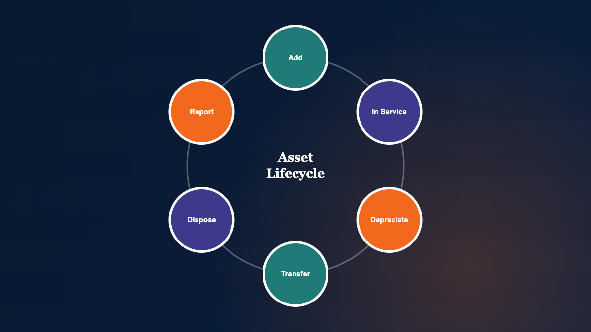

## Why Fixed Assets Break in Spreadsheets as You Grow

Fixed asset management should not consume strategic attention. Yet many small and mid-sized finance teams find themselves spending close week reconciling spreadsheet tabs, chasing changes, and rebuilding schedules that were "done last month." The issue is rarely your ability to calculate depreciation. The issue is control.

### The Real Problem Is Governance, Not Formulas

A fixed asset register is a governance system. It answers basic questions that auditors, lenders, tax teams, and management will ask:

- What do you own, and where is it?
- What is the cost basis, and what changed?
- What depreciation method applies for book and tax?

Spreadsheets can store answers, but they struggle to enforce discipline. Over time, you get silent drift: inconsistent naming, missing in-service dates, and differing assumptions by preparer.

### Where Spreadsheet Risk Shows Up: Close, Audit, Tax, and Lending

Spreadsheet fragility is easy to ignore until a deadline arrives. Then it becomes expensive in hours and reputational stress.

- Month-end close: depreciation ties out until it does not, and you burn time tracing one cell.
- Audit support: you need clear rollforwards, disposal support, and defensible method consistency.
- Tax support: book and tax depreciation diverge, and your files multiply.
- Bank reporting: lenders want schedules that reconcile cleanly to the GL and financial statements.

### What Multi-User Reality Does to Version Control

The first fixed asset spreadsheet often works because one person "owns" it. Growth changes the operating model. Multiple users touch additions, disposals, and coding across locations or entities. Version control becomes the hidden cost.

If you have ever asked, "Which file is the real one?" you have already outgrown the spreadsheet approach.

## What Fixed Asset Management Software Should Control

Fixed asset management software earns its keep by doing one thing exceptionally well: creating a single source of truth that stays coherent under change. That coherence is what saves time and reduces risk.

### A Single Source of Truth Across Entities, Locations, and Departments

As assets expand across sites, departments, and legal entities, your chart of accounts and reporting needs do not get simpler. A proper fixed asset system should let you organize assets in a way that matches how the business is managed and audited.

- Multi-entity tracking with clean separation of records.
- Location and department attributes that support internal reporting.
- Consistent identifiers that prevent duplicates and orphan assets.

### Lifecycle Discipline: Additions, Transfers, Disposals, and Impairments

Fixed asset accounting is a lifecycle. The risk is not in the initial capitalization entry. The risk is in the changes that occur later: partial disposals, transfers between cost centers, placed-in-service corrections, and policy updates.

Fixed asset accounting software should make these events routine, not heroic.

### An Audit Trail You Can Explain Without Improvisation

Audit readiness is not a vibe. It is structure. You need to show what changed, when it changed, and why it changed, in a way that another professional can follow.

Look for systems that support disciplined recordkeeping and consistent reporting from the same underlying data.

## Depreciation: GAAP Discipline and Tax Reality in One Workflow

Depreciation is where many teams bleed time. Not because the math is hard, but because the rules multiply and exceptions accumulate.

### Define Terms Once: Book Depreciation vs. Tax Depreciation

GAAP depreciation (book depreciation) follows your financial reporting policies: useful lives, salvage values (if applicable), and methods aligned with how the asset provides economic benefit. See the [FASB Accounting Standards Codification](https://asc.fasb.org/) for the governing framework.

Tax depreciation follows the tax code. The objective is compliance, not economic matching. The same asset can have multiple depreciation profiles depending on what you are reporting.

### How MACRS Depreciation Complicates Spreadsheet Methods

MACRS depreciation is the U.S. tax system for most tangible assets — detailed in [IRS Publication 946, How To Depreciate Property](https://www.irs.gov/publications/p946). Conventions, classes, and rule changes mean that "one template" rarely stays stable across years and entities.

Tax depreciation software should not require you to rebuild logic each time rules update or asset classes shift. It should encode the rules and let you focus on decisions and review.

### What "Asset Depreciation Software" Should Automate

Automation matters most where repetition creates error risk. Your depreciation engine should handle the mechanics consistently and transparently.

- Built-in depreciation rules for common book and tax methods.
- Support for method changes and corrections without breaking schedules.
- Repeatable depreciation runs that produce consistent outputs month after month.

## Reporting That Finance Actually Uses

Reports are where fixed asset work becomes visible to the rest of the organization. If reporting is slow, finance becomes a bottleneck. If reporting is inconsistent, finance becomes a risk.

### Schedules for Audit and Financial Statements

At minimum, you need schedules that reconcile and explain. A solid fixed asset depreciation software platform should generate:

- Beginning-to-ending rollforward schedules with additions and disposals.
- Accumulated depreciation and net book value summaries by category.
- Depreciation expense schedules that tie to your GL mapping.

### Fixed Asset Tax Reporting: Returns, Property Tax, and Support Files

Fixed asset tax reporting is broader than an income tax return. Property tax filings, state apportionment support, and documentation requests often require specialized cuts of the data.

A structured system lets you produce the same schedule again next year, with fewer ad hoc rebuilds.

### Custom Views: Same Data, Different Audiences

Different stakeholders want different slices of the truth. The controller may need an audit-ready rollforward. Operations may want assets by location. Tax may need class-life groupings.

Custom data views are not cosmetic. They are how you deliver clarity without duplicating data in new files.

## Excel vs. ERP Fixed Asset Module vs. Standalone Fixed Asset Accounting Software

Most teams evaluate three paths. The right choice depends on complexity, tolerance for risk, and how much time you are willing to allocate to maintenance.

### When Excel Is Acceptable, and When It Stops Being Defensible

Excel can be acceptable when:

- Asset counts are low and stable.
- One preparer controls all changes.
- Reporting needs are simple and infrequent.

Excel becomes hard to defend when multi-user changes, multiple entities, frequent disposals, or recurring audit requests enter the picture. At that point, the spreadsheet is no longer a tool. It is an operational dependency with weak controls.

### Why ERP Modules Feel "Included" but Still Cost You Time

An ERP fixed asset module can look like the simplest answer because it is already there. The usual problem is practical: reporting flexibility and day-to-day usability. Finance teams often spend time exporting, reformatting, and rebuilding schedules to satisfy audit and tax needs.

"Included" is not the same as "fit for purpose."

### Why Standalone Systems Are Often the Pragmatic Middle Path

A standalone fixed asset management software solution can provide control and reporting without forcing you into enterprise-level complexity. The objective is disciplined outputs with minimal administration.

For SMB and lower middle-market finance teams, this is often the best tradeoff: professional capability without bloat.

## A Practical Buying Checklist for Fixed Asset Software

Buying fixed asset software is a control decision. Use a checklist that reflects the work you actually do under deadline.

### Core Capabilities to Require on Day 1

- Central register: one database, consistent fields, and structured asset IDs.
- Depreciation engine: book and tax methods with repeatable depreciation runs.
- Reporting: audit schedules, tax support, and management views you can regenerate.
- Scalability: multi-user teams and multiple companies as your structure evolves.

### Questions to Ask Before You Migrate Data

- Can you import your existing asset list with validation checks?
- How do you handle disposals, partial disposals, and corrections?
- Can you map depreciation expense and accumulated depreciation to your GL accounts?

### Signals of Value: Training, Support, and Total Cost

Software quality shows up during close. Evaluate the vendor on:

- Onboarding: a guided session that gets you productive quickly.
- Training: video-on-demand resources and a written user guide.
- Support: responsive, human help when deadlines are real.

Value is not just license price. It is time reclaimed and errors removed from a recurring workflow.

## How Ledgerline Assets Fits: Structure Without Enterprise Bloat

Ledgerline Ledgerline Assets is built for finance teams that need defensible fixed asset accounting without the overhead of enterprise systems. The goal is simple: replace spreadsheet chaos with a single, reliable system that supports close, audit, and tax reporting.

### Designed for SMB Finance Teams That Respect the Close

Ledgerline Assets emphasizes practical control:

- Centralized fixed asset data that stays consistent across users and periods.
- Built-in automated depreciation rules kept current with tax depreciation changes.
- Custom data views that help you produce reports without rework.

### What You Get: Depreciation Rules, Reporting, Onboarding, and Support

- Unlimited company and asset tracking for growing organizations.
- Fast report generation for financial and tax purposes.
- Free onboarding session, video training, and a comprehensive user guide.
- Priority technical support when you cannot afford downtime.

It is also priced to fit SMB budgets, with strong value-for-money and ease-of-use sentiment reflected in third-party review averages.

### A Low-Risk Way to Validate: Trial, Onboarding, and Guarantee

Risk-conscious buyers should be. Ledgerline Assets supports evaluation with real data and real reports, backed by a 30-day money-back guarantee. The right proof is not a feature list. It is whether you can run depreciation, produce schedules, and reconcile to the GL with less friction.

## Next Step: Replace Spreadsheet Friction With a Structured System

If your fixed asset process feels heavier each quarter, treat that as a signal. Time is a financial asset, and manual reconciliation consumes it.

### A Simple Pilot Plan Using Real Asset Data

- Select one entity and one recent period for a controlled test.
- Import a representative asset population including disposals and transfers.
- Run book and tax depreciation, then compare to your current schedules.

### What to Measure: Time Reclaimed, Errors Removed, and Report Readiness

- Hours spent preparing depreciation and rollforwards each month.
- Number of tie-out issues and manual adjustments required.
- Time to produce auditor- or lender-ready schedules on request.

### How to Get a Demo or Start a Trial

Explore a structured alternative. See whether Ledgerline Assets gives you the control to close faster and defend your numbers under audit, without adding enterprise bloat.

_Strengthen control. Reclaim time._
