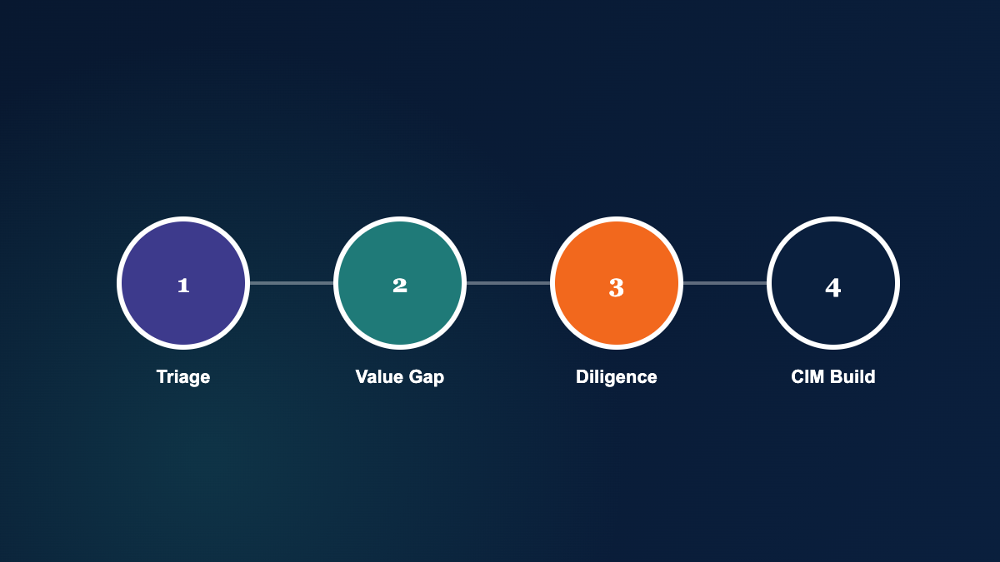

## What "Handle More Deal Opportunities" Really Means in a Commission-Based Practice

Control precedes insight. When your compensation depends on closes, "more opportunities" is only valuable if you can qualify them quickly, bring the right ones to market, and keep them on the rails through diligence and negotiations.

Capacity is a constraint, not a character flaw. Deal volume rises, but your hours do not. The question becomes practical: how do you increase throughput without lowering standards or multiplying risk?

In most mid-market practices, two bottlenecks show up first.

- Analysis time that expands because each target requires new spreadsheets, new assumptions, and new formatting.
- Downstream surprises that force rework, renegotiation, and credibility repair during due diligence.

A defensible process is the scalable asset. Software should reinforce discipline, not merely generate a number.

## Where Deal Capacity Breaks First: The Spreadsheet Pattern

Spreadsheets are not "bad." They are simply fragile when deal flow, complexity, and collaboration increase. Fragility creates hidden time costs.

### Triage Slows Because Inputs Are Inconsistent

When each opportunity arrives with a different chart of accounts, a different level of cleanup, and a different set of add-backs, triage becomes a mini-project. That steals time from the opportunities that deserve it.

### Valuation Debates Become Subjective and Circular

Sellers rarely resist analysis. They resist ambiguity. If your valuation logic is hard to explain or hard to reproduce, price and terms discussions become opinion-based. That is where timelines stretch. For a plain-language look at how valuation factors are weighed, see the [IRS guidance on valuation of business interests](https://www.irs.gov/businesses/small-businesses-self-employed/valuation-of-business-interests).

### Due Diligence Becomes Reactive, Not Preventive

Surprises are great for birthdays, but not during due diligence. Reactive diligence produces predictable outcomes — see the [SEC's investor bulletin on M&A concepts](https://www.sec.gov/oiea/investor-alerts-bulletins/ib_mergersacquisitions.html) for a sense of how closely these transactions get scrutinized.

- Price reductions and adjustments after the LOI.
- Lower cash at closing through holdbacks, escrows, or contingent payments.
- Aggressive contract terms that shift risk back to the seller.
- A buyer walking away, leaving no deal to close.

### Pitch Books and CIMs Become a Production Job

When the deliverable depends on cutting and pasting tables, managing linked files, and chasing formatting, your team spends time on mechanics instead of marketing. Engagements have an expiration date. Every week spent "prepping" is a week not spent in front of qualified buyers.

## A Disciplined Framework to Increase Throughput Without Lowering Standards

Handling more deal opportunities is not about moving faster everywhere. It is about moving faster at the right moments, with fewer reversals later. Use a framework that matches the transaction workflow.

### Step 1: Opportunity Triage With Explicit Pass/Fail Criteria

Triage is the decision to invest scarce attention. Make the decision criteria explicit, then apply it consistently.

- Data sufficiency for at least 3 years of financial statements and meaningful add-back support.
- Quality of earnings signals that indicate normalized EBITDA is defensible.
- Market fit indicators that suggest buyers will underwrite the story.

### Step 2: Define the Value Gap and Document Assumptions

The "value gap" is the difference between what the market can justify and what the seller wants. Defining it early keeps the process honest.

Document assumptions you can defend: normalization adjustments, growth expectations, margin sustainability, working capital needs, and capex reality. Clear assumptions reduce emotion in price discussions.

### Step 3: Pre-Sale Due Diligence as Risk Control

Pre-sale diligence is not busywork. It is risk governance. The goal is to identify issues that would predictably be used as leverage later, and address them while you still have time and negotiating room.

### Step 4: Buyer-Ready Story: Numbers Plus Narrative

Buyers are more sophisticated than they were 10 years ago. They expect you to have command of the numbers. A credible CIM connects the operational story to the financial evidence in a way a buyer can underwrite.

### Step 5: Terms Stress Test: Seller Notes and Contingent Payments

If the seller provides financing or accepts contingent payments, the seller is acting as a bank or investor. Treat it that way. Test payback feasibility under conservative scenarios and document the logic.

## What to Look For in Valuation Tools and Business Broker Tools

Not all valuation tools are built for the transaction process. Many programs stop at a valuation output, leaving you to stitch together diligence, marketing materials, and analysis logic across separate files.

### Built for the Transaction Workflow, Not Just a Single Output

Look for support across the full cycle: triage, valuation or market study, diligence preparation, and buyer-facing deliverables.

### Auditability: Tie-Outs, Sources, and Consistent Schedules

Your analysis should tie back to the income statement and balance sheet cleanly. If it does not, you will spend time defending mechanics instead of negotiating outcomes.

### Speed Without Fragility

Speed comes from structure, not shortcuts. The best systems reduce manual linking, version control problems, and formatting overhead.

### Client-Facing Deliverables That Are Editable and Branded

Your output represents your practice. If Pitch Books and CIMs are locked down or "cookie cutter," you will either fight the tool or revert to Word and spreadsheets again.

## How Ledgerline Deals Helps You Get More Deals to Market Faster

Ledgerline's Ledgerline Deals is a field-tested alternative to time-consuming spreadsheets and valuation-only programs that do not go the distance. It is designed for the M&A transaction process, where your leverage comes from disciplined analysis and credible deliverables.

### Wall-to-Wall Analysis in One System

Ledgerline Deals consolidates the core analytical work so you are not rebuilding the same logic in new files for every opportunity. That is how capacity increases without compromising control.

### Triage and Market Studies That Reduce Wasted Cycles

When compensation is success-based, the cost of poor triage is invisible until you look at the calendar. Ledgerline Deals supports early-stage evaluation so you can focus on opportunities likely to bear fruit.

### Pre-Sale Diligence That Prevents Deal-Killing Surprises

Using a structured diligence approach, you can identify likely friction points before buyers do. The objective is simple: fewer renegotiations, fewer credibility events, and fewer stalled deals.

### Pitch Books and CIMs That Buyers Actually Trust

Ledgerline Deals helps you create Pitch Books and CIMs that include the numbers buyers want to see. Solid preparation reduces the risk of an LOI going off the rails and increases your influence in negotiations.

### Word-Editable Outputs to Fit Your Voice and Brand

Ledgerline Deals Pitch Books can be edited in Microsoft Word and are fully customizable. Reports generate quickly, reducing the aggravation of cutting, pasting, and managing spreadsheet links.

## Key Metrics Buyers Expect to See in a Credible CIM

If you want to handle more deal opportunities, you need buyer-ready deliverables that can be produced quickly and defended under scrutiny. A strong CIM presents the key metrics in a structured way.

- Financial snapshot of income statement and balance sheet data with clear periods.
- Up to 5 years of history summarized consistently across statements.
- Adjusted EBITDA that ties back directly to the income statement.
- Adjusted free cash flow using total invested capital logic.
- Growth rates including compound annual growth for sales, net income, EBITDA, and cash flow.
- Net working capital summary used within free cash flow calculations.
- Historic cash flows presented to support sustainability questions.
- Ratio analysis covering liquidity, leverage, debt coverage, operating performance, and equity metrics.
- Industry comparison to frame performance in market context.
- Projections for up to 5 years with assumptions that are easy to interrogate.
- Capex view including EBITDA, capital expenditures, and EBITDA minus capex.
- Transaction terms such as asking price, suggested terms, and key asset details.

## A Practical Workflow for Preparing a Business for Sale (Without Extending the Timeline)

Preparing a business for sale should not become an endless pre-market phase. Use a time-boxed workflow that forces decisions and surfaces risk early.

### Week 1: Data Capture, Normalization, and Initial Triage

- Collect historical statements with supporting schedules.
- Normalize EBITDA with documented add-backs.
- Decide quickly: proceed, pause, or decline.

### Week 2: Value Gap and Positioning Decisions

- Produce a valuation or market study for objective discussion.
- Define the value gap and the levers that could close it.
- Align on price expectations and key terms.

### Week 3: Diligence Drill-Down and Risk Register

- Identify diligence risks likely to affect price or terms.
- Build a remediation plan with owners and deadlines.
- Prepare evidence that will be requested by buyers.

### Week 4: CIM Build, Buyer List Readiness, and Launch

- Create a Pitch Book or CIM combining narrative and metrics.
- Confirm the data tie-outs and consistency across schedules.
- Move to market with qualified outreach.

## Proof-Driven Questions to Ask Before You Commit to a Deal Tool

Software should reduce friction, not relocate it. Before you standardize on a system, test it against the realities of your practice.

- Can you replicate outputs next month with the same logic and formatting?
- Do reports tie back cleanly to the underlying financial statements?
- Can a teammate take over without reverse-engineering your model?
- Will the deliverable survive scrutiny from buyers, lenders, and advisors?

## Next Step: See the Workflow With Your Own Deal Data

If you want to handle more deal opportunities, the fastest way to decide is to see the workflow using the kind of financials you deal with every week.

- **Call Us:** Speak with a knowledgeable product advisor at [800-555-0142](tel:+18005550142).
- **Live Chat:** Chat with friendly, knowledgeable associates to confirm fit and workflow.
- **Email Us:** Use Ledgerline's [contact form](/contact/) to request a demo and share your requirements.

Ledgerline Deals is built to replace spreadsheet distraction with structured analysis, shorten deal cycles, and help you earn more of your success-based upside through disciplined execution.
